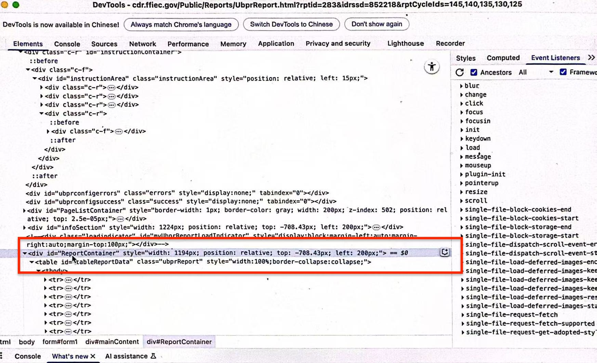

# Automated Extraction of Bank Ratios from FFIEC UBPR

We developed an automated script using Python to collect quarterly data for each U.S. bank directly from the official FFIEC (Federal Financial Institutions Examination Council) website.

---

## Purpose

The goal of this program is to download ratio data for a list of specific banks (identified by their unique IDRSSD numbers), without manually clicking and navigating the FFIEC website for each bank.

---

## Setup

- We use `Selenium` for browser automation — it acts like a robot that opens Chrome and clicks buttons like a human.
- We use `PyAutoGUI` to simulate mouse movements when certain download buttons can't be clicked via code.
- The script is written in Python, and the CSV files are saved automatically into your chosen folder.

---

## How It Works

1. For each bank in your IDRSSD list, the program opens the FFIEC UBPR page.
2. It selects the report type: **"Uniform Bank Performance Report"**.
3. It inputs the bank’s IDRSSD and clicks "Generate Report".
4. The report opens in a new browser tab — the script then clicks **"Summary Ratios"**.
5. Then it clicks the **line chart download icon** for your target ratio.
6. It simulates real mouse clicks to download the CSV file.
7. The file is automatically renamed with the bank’s IDRSSD and moved to your target folder.
8. If the page fails or a download error occurs, it continues with the next bank.

---

## How to Target a Specific Ratio

To download a specific ratio (e.g., "Net Loans & Leases to Assets") from the summary table:
1. On the summary ratio page, right-click to choose inspection to open Dev mode.

2. Target the line "id=ReportContainer"
2. Find the `<tr></tr>` element corresponding to your ratio under Line "id=ReportContainer"  in the developer tools panel.

3. Inside it, find an element with `id="trend-dl-..."` — right-click it → **Copy → Copy selector**.
4. Replace the following line in the script with your copied selector:
   ```python
   chart_button = driver.find_element(By.XPATH, "//*[@id='trend-dl-40-609723-dl']")

## Error Handling

If something goes wrong (for example, the page doesn't load or the download fails), the program catches the error and continues with the next bank. This ensures we don’t have to restart from the beginning every time.

## Result

The program generates individual .csv files for each bank, containing their reserve ratio data for the past 96 quarters. These are then ready for analysis.

